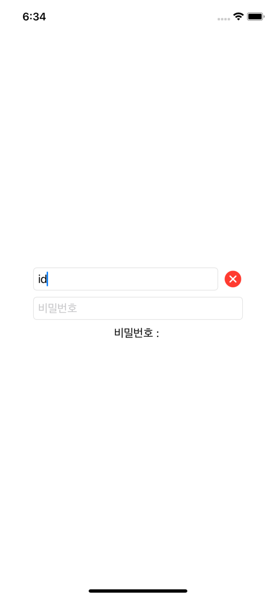
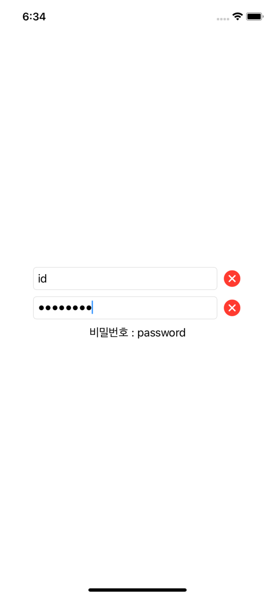
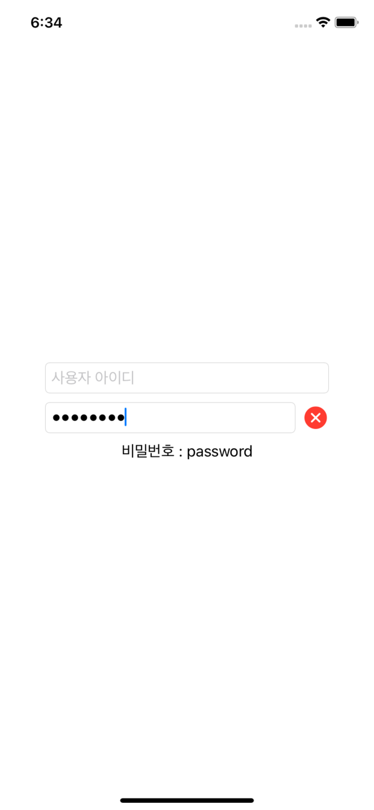

# SwiftUI-login-textfield

### just simple example \*

using `text-field` and `secure-field`

### _just front-end_

로그인 화면 구현에 필요한 text-field와 secure-field를 사용해보았다.

입력이 들어오면 필드옆에 초기화 버튼을 생성하여 입력을 취소할 수 있게 만들었다.

Xcode12.3
simulator - iphone11

screen shot 🧷

`첫 화면`

`id 입력시`

`password 입력 시`

`id 초기화`

